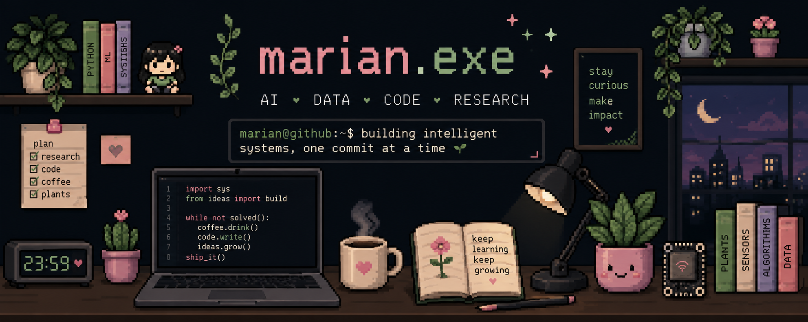

  

### ୨ৎ about

I'm a graduate researcher and developer curious about all things **AI, data, intelligent systems, and software** ✦

I like building projects that connect **code, sensors, data, and the real world** — from hyperspectral imaging and plant phenotyping to optimization, IoT dashboards, and forecasting

### ୨ৎ currently

🌱 **researching** intelligent systems  
💻 **building** ML + data projects  
🧠 **exploring** AI engineering and LLM applications  
📚 **learning** better software engineering practices  
🐛 **debugging** something, probably  

### ୨ৎ tech stack

  

  <code>Python</code>
  <code>C++</code>
  <code>JavaScript</code>
  <code>HTML</code>
  <code>CSS</code>
  <code>Git</code>
  <code>GitHub</code>
  <code>Firebase</code>
  <code>VS Code</code>

  MATLAB · SQL · ESP32 · Machine Learning · Computer Vision · Scientific Computing

### ୨ৎ contributions

  

  🌱  growing one commit at a time

